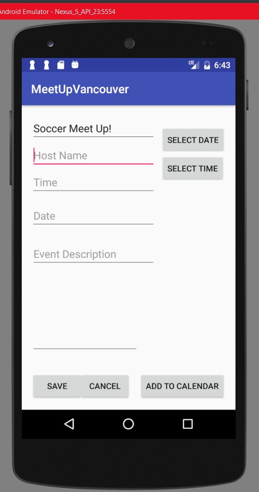
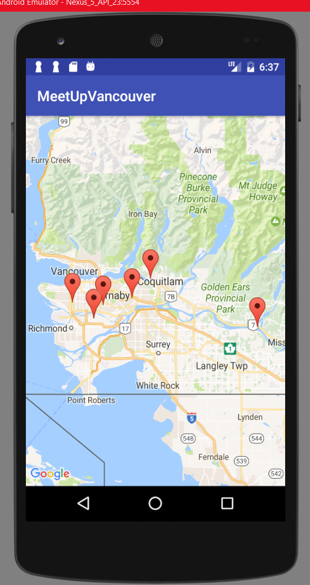

# MeetUpVancouver 
An Android mobile application that brings strangers together. This was developed for SFU's "Google API Challenge" 24 hour hackathon. Langauages used are XML and Java.

## Authors 

Jason Soliman, Davorin Doung, Carlson Chan, Owen Kwok and Jason Chan

## Features
Users can host a public event in the interactive google map, and save their own events to their Google Calendar. 
Other users can log-in and view public events created in Vancouver, and save to their Google Calendar if they choose to participate. 

## Google integration

Google Services including Map, Calendar and Firebase are used to develop this application. 

## Deployment 
Languages used are XML and Java, deployed using Android Studio. 

## Screenshots

* Login Screen: 

    
* Map Screen with events visible:  

  

